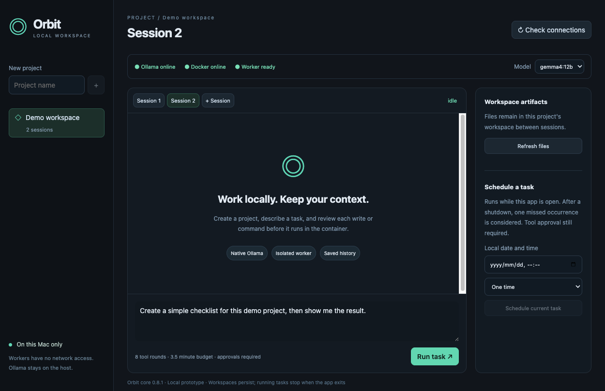

# Orbit App

A local Electron desktop prototype for local agent work. Create a project and session, send a task to native Ollama, and review writes or commands before Orbit executes them in a network-disabled container. No cloud model fallback.

## Desktop preview



Actual Electron UI in a clean demo project. The task text is prepared but has not been submitted.

## About Orbit

[Orbit](https://github.com/cybergarage/orbit) is the TypeScript agent execution framework underlying this app. It provides model adapters, including Ollama, tools, sessions, and execution and approval controls. Orbit App adds the desktop interface and coordinates native host Ollama with containerized Orbit workers.

## Requirements

- macOS with Apple Silicon (verified on the secondary M4).
- Node.js 22.12 or newer and npm; CI uses Node 22, and local validation used Node 26.5.
- Running Docker Desktop and native Ollama at `http://127.0.0.1:11434`.
- An installed tool-capable Ollama model; `gemma4:12b` was verified. Models are not downloaded automatically.

## Install and run

```sh
cd ~/Src/orbit-app
npm ci
npm run worker:build
npm run dev
```

Create a project and session, select a model, and submit a task. Review each requested write or command, then inspect its progress, results, and workspace files. Each project has its own app-managed workspace and persisted Orbit history.

## Build a local app

```sh
npm run package
open "release/Orbit App-darwin-arm64/Orbit App.app"
```

The unsigned arm64 app still requires Docker, Ollama, and the locally built worker image. Docker and models are not bundled; signing and notarization are not included.

## Prototype features and limits

- Project/session management, model and connection health, operation approvals, cancellation, saved history, and top-level artifact listing.
- Durable one-time, hourly, and every-24-hour schedules. **The app must be running.** After shutdown, at most one missed occurrence is considered; interrupted work is not automatically replayed. There is no background daemon.
- Intended for trusted local workspaces. Workers have no network access and receive only their project's workspace/core mounts, without host credentials or the Docker socket. This is not a complete sandbox guarantee: approved Bash can modify the project's core records.
- Per-file limits and a storage watchdog are **not a hard disk quota**; rapid writes can still consume host disk space.
- Orbit's pinned `braces@3.0.3` dependency has an unpatched DoS advisory. Restricted search syntax mitigates the direct glob/grep path, but an approved Bash script can still invoke the vulnerable dependency.

See [verification and security limitations](docs/verification.md) for tested behavior, the advisory, and residual risks.
